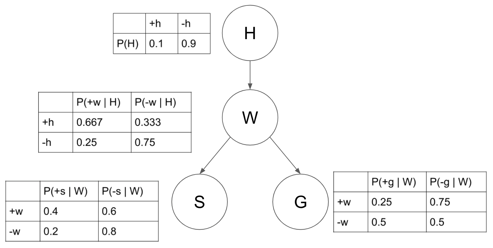

# 贝叶斯网络

## 介绍

贝叶斯网络是一种概率图式模型，通过对随机变量构建有向无环图捕捉其概率分布。更具体地，你的任务为通过条件概率表来完成指定的查询，即给定先验概率 $P(Q)$ 和条件概率 $P(E|Q)$, 求解后验概率 $P(Q|e)$. 为了解决这一问题，我们可以构建联合分布

$$ P(EQ) = P(E|Q) P(Q) $$

再计算

$$ P(Q|e) = \frac{P(Qe)}{P(e)} = \frac{P(Qe)}{\sum_{q} P(qe)} $$

这样就可以通过联合概率分布来计算后验概率。这一实现存在两个很大的问题：
1. 完整的联合分布概率表的大小与事件个数呈指数关系（为什么？），导致存储与计算开销太大。
2. 先验地估计所有信息是困难的。

为此我们考察使用条件概率分布进行推理，即使用贝叶斯公式：

$$ P(Q|e) = \frac{P(e|Q) P(Q)}{\sum_{q} P(e|q) P(q)} $$

这是贝叶斯网络背后的动机：一种使用简单的局部分布（条件概率）描述复杂联合分布（模型）的技术。我们描述变量如何在局部相互作用，并将这些作用组合建模全局的间接相互作用。

## 栗子

在使用 Google 搜索时，当你不小心输入一个不存在的单词时，搜索引擎会提示你是不是要输入某一个正确的单词。Google的拼写检查基于贝叶斯方法。下面我们就来看看，怎么利用贝叶斯方法，实现"拼写检查"的功能。

用户输入一个单词时，可能拼写正确，也可能拼写错误。如果把拼写正确的情况记做c（代表correct），拼写错误的情况记做 w（代表wrong），那么“拼写检查”要做的事情就是：在发生 w 的情况下，试图推断出 c。换言之，已知w，然后在若干个备选方案中，找出可能性最大的那个 $c$, 也就是求 $P(c|w)=P(w|c)P(c)/P(w)$ 的最大值，故只需考察 $\operatorname{argmax}_{c} P(w|c)P(c)$ 即可。

上面是一个实际的贝叶斯网络的例子，其中每个节点代表一个事件，节点对应的表即为贝叶斯网络中存储的信息，若我们想要计算 $ P(+w \mid +s, -g) $，则有：

$$ P(+w \mid +s, -g) = \frac{P(+w, +s, -g)}{P(+s, -g)} $$

（链式规则）

$$ P(+w, +s, -g) = \sum_h P(h, +w, +s, -g) $$

（边缘化）

$$ \sum_{h, w} P(h, w, +s, -g) = \sum_h P(h)P(+w \mid h)P(+s \mid +w)P(-g \mid +w) $$

（联合概率分布 = 边缘概率分布的乘积）
$$
\begin{aligned}
P(+w \mid +s, -g) &= \frac{P(+w, +s, -g)}{P(+s, -g)} \quad (\text{条件概率}) \\
&= \frac{\sum_h P(h, +w, +s, -g)}{\sum_{h, w} P(h, w, +s, -g)} \quad (\text{联合分布转边缘分布}) \\
&= \frac{\sum_h P(h)P(+w \mid h)P(+s \mid +w)P(-g \mid +w)}{\sum_{h,w} P(h)P(w
\mid h)P(+s \mid w)P(-g \mid w)} \quad (\text{转为条件概率的乘积}) \\
&= \frac{0.1 \times 0.667 \times 0.4 \times 0.75 + 0.9 \times 0.25 \times 0.4 \times 0.75}{0.1 \times 0.667 \times 0.4 \times 0.75 + 0.9 \times 0.25 \times 0.4 \times 0.75 + 0.1 \times 0.333 \times 0.2 \times 0.5 + 0.9 \times 0.75 \times 0.2 \times 0.5} \\
&= 0.553
\end{aligned}
$$